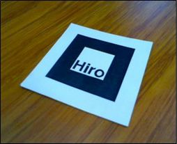

# AR Sandbox

This is a study repository of AR technology driven by react and 3D/AR libs.

- Vite
- ReactJS
- React Three Fiber (for 3D rendering)
- React Three Fiber AR (for camera and markers techniques)

## Install
```
$ npm install
```

## Run
```
$ npm run dev
```

## Build
```
$ npm run build
```

## About demo

There is a demo using hiro marker.

Use a camera to capture it, then the 3D images could be rendered.




> The best way to use this marker is to print it.

> You can try use a phone with the image, but the reflexive screen could spoil the results of the marker identification.

Click here for [Live demo](https://mataca9.github.io/ar-sandbox/)
